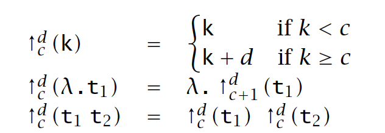
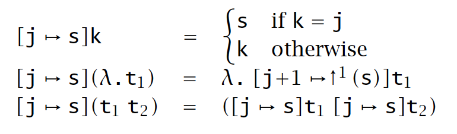

# Lambda Calculus

## 1. syntax

```math
t ::= x | \lambda x. t | t \ t
```

## 2. rule
Evaluation rule:
1. full beta-reduction: 
```math
\frac{t_1 \rightarrow t_1^\prime}
{t_1 \  t_2 \rightarrow t_1^\prime \  t_2}\\
```

```math
\frac{t_2 \rightarrow t_2^\prime}
{t_1 \  t_2 \rightarrow t_1 \  t_2^\prime}\\
```

```math
\frac{t \rightarrow t^\prime}
{\lambda x. t \rightarrow \lambda x.t^\prime}\\
```

```math
(\lambda x. t_1) \ t_2 \rightarrow [x \mapsto t_2]t_1
```

2. normal-order:

```math
\frac{t_1 \rightarrow t_1^\prime}
{t_1 \  t_2 \rightarrow t_1^\prime \  t_2}\\
```

```math
\frac{t \rightarrow t^\prime}
{\lambda x. t \rightarrow \lambda x.t^\prime}\\
```

```math
(\lambda x. t_1) \ t_2 \rightarrow [x \mapsto t_2]t_1
```

3. lazy:

```math
\frac{t_1 \rightarrow t_1^\prime}
{t_1 \  t_2 \rightarrow t_1^\prime \  t_2}\\
```

```math
(\lambda x. t_1) \ t_2 \rightarrow [x \mapsto t_2]t_1
```

4. by value:

```math
\frac{t_1 \rightarrow t_1^\prime}
{t_1 \  t_2 \rightarrow t_1^\prime \  t_2}\\
```

```math
\frac{t_2 \rightarrow t_2^\prime}
{t_1 \  t_2 \rightarrow t_1 \  t_2^\prime}\\
```

```math
(\lambda x. t_1) \ v_2 \rightarrow [x \mapsto v_2]t_1
```

## 3. Substitution

### 3.1 original term
Most cases are straight forward, special cases:
$[a \mapsto b]\lambda a. x$: refuse to substitude
$[a \mapsto b]\lambda b. a b$: change name of b to something new (say, w)

### 3.2 nameless representation
Shifting rules:


Substitution rules:
